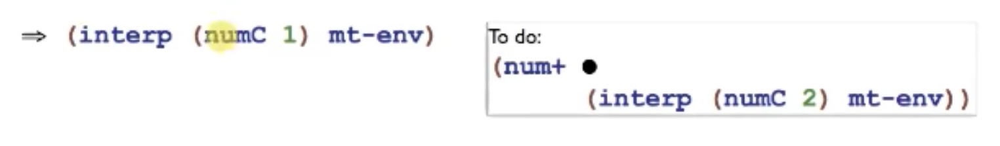
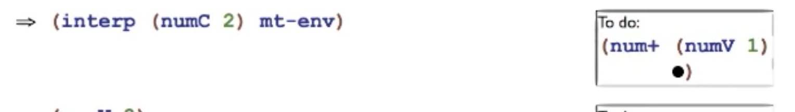
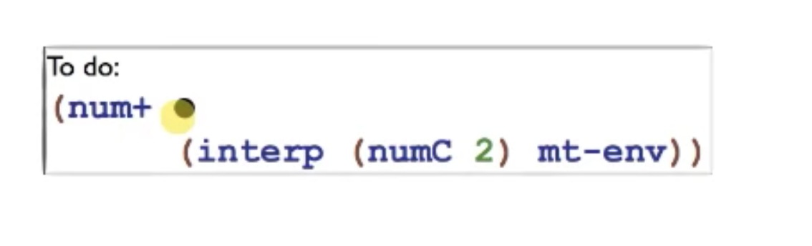
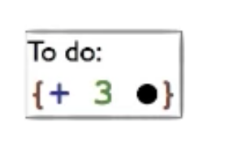
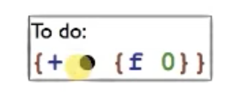
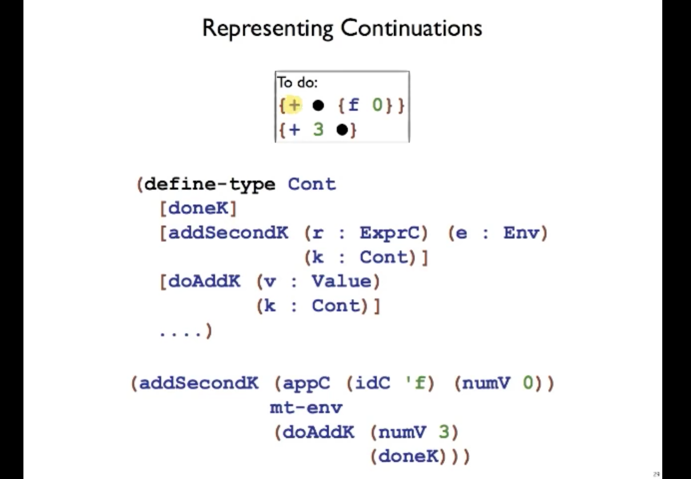

# Continuations


## Intro: Taking control of eval order

`plai` is an eager language, but `plai-typed` is lazy.

Think of plai-typed as "consulting to-do lists"!

It has a level of evaluation as "form to-do lists" but those don't get evaluated until the very end.

Consider:

```racket
(interp (addC (numC 1) (numC 2)) mt-env	)
```

It becomes

```racket
(num+ (interp (numC 1) mt-env)
		(interp (numC 2) mt-env))
```

it calls `(interp (numC 1) mt-env )` first, but remembers to feed the value back into the num+, where interp is waiting for 2nd expression.



then 2nd interp is called...




(i.e. "todo list: remember that numV 1 is waiting")

then results in `num+ ...`


## Continuations

"How should you continue running your program once you get a value for the current sub-expression."

Continuation: representation **of the next step of computation.**

**Continuation passing style: style where computation is expressed as a stack and a call to its continuation**. CPS forces you to see every computation asa series of steps


## Notion of a todo list

Call a "todo" list as a **continuation.**



Any expression ... need to remember we're inside num+

**Can also be implemented as a stack.**

stack <=> continuation

A data structure that represents the computational process at a given point in execution!

Useful for encoding control mechanisms i.e. **exceptions, generators, coroutines**

**"first class continuations"**: give any PL the ability to save execution point at any point, and return there


### How are continuations similar/different to callbacks?

Similar: you can pass around a function as the next step of computation

**Difference**: CPS is **not** related to async/I/O/blocking operations


## 2: Representation

## how to explicitly represent continuations in the interpreter.



`doAddK`: Continuation - do an add when you get a value. `doAddK (numv 3)` represents the continuation.



"Need to do 2nd argument to add them together"

Not a value yet - `{f 0}` : **`addSecondK`**





- think of it as just a data structure **(i.e. addSecondK is "currently executing this step r, the next step is to do doAddK (numV3)")**
- doAddK does DoneK once done. 


Implementing CPS in Lisp?

```lisp
call/cc => (lambda (f cc) (f (lambda (x k) (cc x)) cc))
```


Implementing `call/cc` in JS?

```js
function callcc(f, cc) {
	f(function(x, k) {
		cc(x)
	}, cc)
}
```


## Great Resources!

[Continuation-passing style in JS](http://matt.might.net/articles/by-example-continuation-passing-style/)

[Continuations by example - Exceptions, generators, threads, coroutines](http://matt.might.net/articles/programming-with-continuations--exceptions-backtracking-search-threads-generators-coroutines/)

[What's the difference between a continuation and a callback?](https://stackoverflow.com/questions/14019341/whats-the-difference-between-a-continuation-and-a-callback)